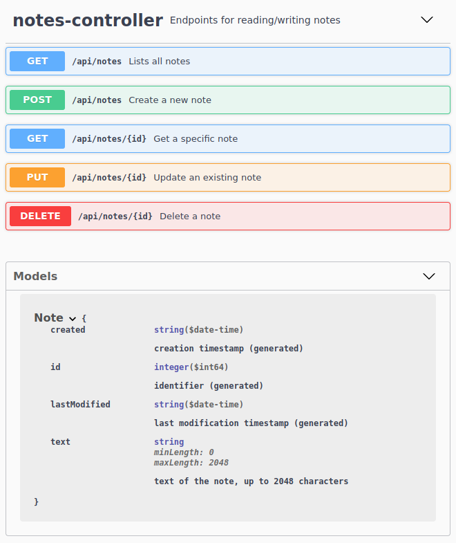

# Easy Rest Client


**A new approach on writing REST web service clients using declarative interfaces with JAX-RS annotations.**

## Idea

This project was inspired by the way *Spring Data Repositories* are used: an interface serves as a contract, and the
actual implementation is a Java Proxy backed by an Invocation Handler which provides the implementation dynamically
based on the contract.

The idea for the Easy Rest Client is as follows:

- For a rest client, an **interface** defining the connecting endpoint is defined, using web service **annotations**.
- A **factory** method creates an implementation of a rest client, given that interface, a base URL and a web client.
- The **implementation** will be a `Proxy` backed by a `InvocationHandler` (package: `java.lang.reflect`)

## Technology choices

- **Web Service Annotations** for the REST client: **JAX-RS API**. <br>
  Reason: simple API, lightweight, and considered a standard (Java EE) and interoperable (Spring Web annotations are too
  Spring-centric).
- **HTTP Client**: `java.net.http.HttpClient` (built-in since Java 11). <br>
  Reason: available in Java standard Library, so no additional libraries are required.

## JAX-RS Annotation Support

The following JAX-RS annotiations (package: `javax.ws.rs`) are already supported:

- [x] `@Path` (on class or method)
- [x] `@GET` (on method)
- [x] `@POST` (on method)
- [x] `@PUT` (on method)
- [x] `@DELETE` (on method)
- [x] `@Consumes` (on method)
- [x] `@Produces` (on method)
- [x] `@PathParam` (on method)
- [x] `@QueryParam` (on method)
- [x] `@HeaderParam` (on method)
- [ ] `@FormParam` (on method)

Supported content types:

- [x] JSON (`application/json`)
- [x] XML (`application/json`)
- [x] TEXT (`text/plain`)
- [ ] Multipart/Form data
- [ ] Binary formats

## Example Usage

Let's say we want to use the following REST web service for reading and writing simple notes (as JSON):



On the client side, we need to create

- the required DTOs for the requests and responses
- the service contract interface for the client, annotated with JAX-RS annotations

### DTO (Note)

```java
public class Note {

    private Long id;
    private OffsetDateTime created;
    private OffsetDateTime updated;
    private String text;

    // getters, setters, equals and hash code omitted
}
```

### Service Contract Interface

```java
@Path("api/notes")
public interface NotesClient {

    @GET
    @Produces(APPLICATION_JSON)
    List<Note> list();

    @GET
    @Path("/{id}")
    @Produces(APPLICATION_JSON)
    Note get(@PathParam("id") long id);

    @POST
    @Consumes(APPLICATION_JSON)
    @Produces(APPLICATION_JSON)
    Note create(Note note);

    @PUT
    @Path("/{id}")
    @Consumes(APPLICATION_JSON)
    void update(@PathParam("id") long id, Note note);

    @DELETE
    @Path("/{id}")
    void delete(@PathParam("id") long id);
}
```

**HINT:** the `@Produces` annotation is _optional_ for the client, as the actual content type from the reponse headers is considered for the deserialization of structured data.

The instance for this client would be created as follows:

```java
HttpClient httpClient = HttpClient.newBuilder().build();
String baseUrl = "https://test.org";

NotesClient notesClient = RestClient.build(httpClient, baseUrl, NotesClient.class);
```

:magic_wand: This instance is a **proxy** for the service contract interface, backed by an **invocation handler** which
processes the HTTP requests.

Using the client is then plain simple:

```java
Note note = new Note();
note.setText("Aloha");

// create
Note created = notesClient.create(note);

// read
Note loaded = notesClient.get(id);

// list
List<Note> notes = notesClient.list();

// update
note.setText("Lorem ipsum dolor sit amet");
notesClient.update(note.getId(), note);

// delete
notesClient.delete(id);
```

## Support for default and static methods

Since Java 8, interfaces can also have `default` and `static` methods. Rest client interfaces only need to provide
JAX-RS annotations for all the _abstract_ interface methods, and can use additional `default` and `static` methods for more convenient access. 

Example:

```java
public interface HelloClient {
    
  // the abstract interface methods are proxied for REST web calls
  @GET
  @Path("hello/{lang}")
  String hello(@PathParam("lang") String lang, @QueryParam("name") String name);

  // a convenience default method that uses the current user language
  default String hello(String name) {
    return hello(userLanguage(), name);
  }

  // a convenience default method with fixed arguments
  default String helloWorld() {
    return hello("en", "World");
  }

  // static method to determine the current user language
  static String userLanguage() {
    return Locale.getDefault().getLanguage();
  }
}
```
## Logging

The `RestAdapter` will log (over **SLF4J**) all requests and their responses using a **request sequence number** (so the
request and response data can be correlated in the log even when multiple requests are performed concurrently), and
indicate whether the communication was outbound (`>`) or inbound (`<`).

```text
2021-12-30 12:34:56.797  INFO  RestAdapter  : 1 > POST http://localhost:32999/api/notes
2021-12-30 12:34:56.711  INFO  RestAdapter  : 1 > {"text":"Aloha"}
2021-12-30 12:34:56.701  INFO  RestAdapter  : 1 < 201 Created
2021-12-30 12:34:56.702  INFO  RestAdapter  : 1 < {"id":1000,"created":"2021-12-30T13:44:08.684402+01:00","updated":"2021-12-30T13:44:08.684402+01:00","text":"Aloha"}

2021-12-30 12:34:56.709  INFO  RestAdapter  : 2 > POST http://localhost:32999/api/notes
2021-12-30 12:34:56.709  INFO  RestAdapter  : 2 > {"text":"Another Note"}
2021-12-30 12:34:56.713  INFO  RestAdapter  : 2 < 201 Created
2021-12-30 12:34:56.713  INFO  RestAdapter  : 2 < {"id":1001,"created":"2021-12-30T13:44:08.711746+01:00","updated":"2021-12-30T13:44:08.711746+01:00","text":"Another Note"}

2021-12-30 12:34:56.713  INFO  RestAdapter  : 3 > GET http://localhost:32999/api/notes/1000
2021-12-30 12:34:56.717  INFO  RestAdapter  : 3 < 200 OK
2021-12-30 12:34:56.717  INFO  RestAdapter  : 3 < {"id":1000,"created":"2021-12-30T13:44:08.684402+01:00","updated":"2021-12-30T13:44:08.684402+01:00","text":"Aloha"}
```

## Build

Build with Gradle Wrapper:

```bsh
./gradlew
```