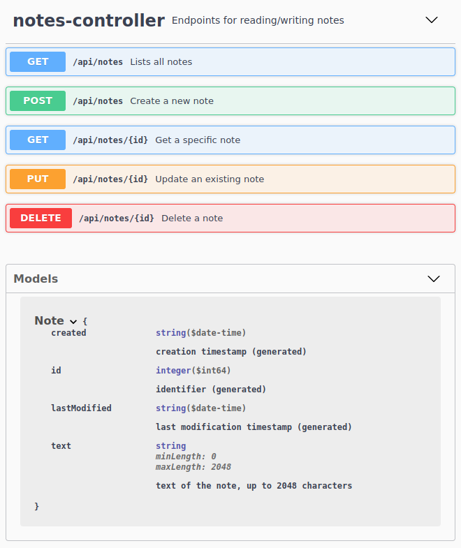

# Easy Rest Client

**A new approach on writing REST web service clients using declarative interfaces with JAX-RS annotations.**

## Idea

This project was inspired by the way *Spring Data Repositories* are used: an interface serves as a contract, and the
actual implementation is a Java Proxy backed by an Invocation Handler which provides the implementation dynamically
based on the contract.

The idea for the Easy Rest Client is as follows:

- For a rest client, an **interface** defining the connecting endpoint is defined, using web service **annotations**.
- A **factory** method creates an implementation of a rest client, given that interface, a base URL and a web client.
- The **implementation** will be a `Proxy` backed by a `InvocationHandler` (package: `java.lang.reflect`)

## Technology choices

- **Web Service Annotations** for the REST client: **Jakarta REST (JAX-RS) API** (package `jakarta.ws.rs`). <br>
  Reason: simple API, lightweight, and considered a standard (Jakarta EE) and interoperable (Spring Web annotations are
  too Spring-centric).
- **HTTP Client**: `java.net.http.HttpClient` (built-in since Java 11). <br>
  Reason: available in Java standard Library, so no additional libraries are required.

## JAX-RS Annotation Support

The following JAX-RS annotations (package: `jakarta.ws.rs`) are supported:

- [x] `@Path` (on class or method) — see [Class-level annotations](docs/class-level-annotations.md)
- [x] `@GET` / `@POST` / `@PUT` / `@DELETE` (on method) — see [HTTP methods and paths](docs/request-methods.md)
- [x] `@Consumes` / `@Produces` (on class or method) — see [Class-level annotations](docs/class-level-annotations.md)
- [x] `@PathParam` (on method)
- [x] `@QueryParam` (on method)
- [x] `@HeaderParam` (on method)
- [x] `@FormParam` (on method) — see [Form data](docs/content-form.md)

Parameter binding (including collections and arrays) is described in [Parameters](docs/parameters.md).

Supported content types:

- [x] JSON (`application/json`) — see [JSON](docs/content-json.md)
- [x] XML (`application/xml`) — see [XML](docs/content-xml.md)
- [x] TEXT (`text/plain`) — see [Plain text](docs/content-text.md)
- [x] Form data (`application/x-www-form-urlencoded`) — see [Form data](docs/content-form.md)
- [x] Multipart/Form data (`multipart/form-data`) — see [Multipart form data](docs/content-multipart.md)
- [x] Binary formats (`application/octet-stream`, streamed) — see [Binary content and streaming](docs/content-binary.md)

## Example Usage

Let's say we want to use the following REST web service for reading and writing simple notes (as JSON):



On the client side, we need to create

- the required DTOs for the requests and responses
- the service contract interface for the client, annotated with JAX-RS annotations

### DTO (Note)

```java
public class Note {

    private Long id;
    private OffsetDateTime created;
    private OffsetDateTime updated;
    private String text;

    // getters, setters, equals and hash code omitted
}
```

### Service Contract Interface

```java
@Path("api/notes")
public interface NotesClient {

    @GET
    @Produces(APPLICATION_JSON)
    List<Note> list();

    @GET
    @Path("/{id}")
    @Produces(APPLICATION_JSON)
    Note get(@PathParam("id") long id);

    @POST
    @Consumes(APPLICATION_JSON)
    @Produces(APPLICATION_JSON)
    Note create(Note note);

    @PUT
    @Path("/{id}")
    @Consumes(APPLICATION_JSON)
    void update(@PathParam("id") long id, Note note);

    @DELETE
    @Path("/{id}")
    void delete(@PathParam("id") long id);
}
```

**HINT:** the `@Produces` annotation is _optional_ for the client, as the actual content type from the reponse headers is considered for the deserialization of structured data.

The instance for this client would be created as follows:

```java
var httpClient = HttpClient.newBuilder().build();
var baseUrl = "https://test.org";

var notesClient = RestClient.build(httpClient, baseUrl, NotesClient.class);
```

:magic_wand: This instance is a **proxy** for the service contract interface, backed by an **invocation handler** which
processes the HTTP requests.

Using the client is then plain simple:

```java
var note = new Note();
note.setText("Aloha");

// create
var created = notesClient.create(note);

// read
var loaded = notesClient.get(id);

// list
var notes = notesClient.list();

// update
note.setText("Lorem ipsum dolor sit amet");
notesClient.update(note.getId(), note);

// delete
notesClient.delete(id);
```

## Examples

The following examples illustrate the individual use cases:

- [HTTP methods and paths](docs/request-methods.md) — `@GET`, `@POST`, `@PUT`, `@DELETE`, `@Path`
- [Parameters](docs/parameters.md) — `@PathParam`, `@QueryParam`, `@HeaderParam`, `@FormParam`, body and sink arguments
- [JSON](docs/content-json.md) — `application/json` request and response bodies
- [XML](docs/content-xml.md) — `application/xml` request and response bodies
- [Plain text](docs/content-text.md) — `text/plain` request and response bodies
- [Form data](docs/content-form.md) — `application/x-www-form-urlencoded`
- [Multipart form data](docs/content-multipart.md) — `multipart/form-data`
- [Binary content and streaming](docs/content-binary.md) — `application/octet-stream`, sinks and temp files
- [Class-level annotations](docs/class-level-annotations.md) — `@Path`, `@Consumes`, `@Produces` on the interface
- [Error handling](docs/error-handling.md) — mapping of HTTP error statuses to JAX-RS exceptions
- [Default and static methods](docs/default-and-static-methods.md) — convenience methods on client interfaces
- [Interface validation](docs/validation.md) — rules invalid client interfaces must follow

## Logging

The `RestAdapter` logs over **SLF4J**.

On **INFO**, one summary line per request with the HTTP method, the URL, the response status code and reason phrase,
and the elapsed time in milliseconds (with 2 decimals):

```text
22021-12-30 12:34:56.710 [DEBUG] RestAdapter: GET http://localhost:32999/api/notes/1000 -> 200 OK, 4.27 ms
```

On **DEBUG**, the request and response details, using a **request sequence number** (so request and response data can
be correlated in the log even when multiple requests are performed concurrently), indicating whether the communication
was outbound (`>`) or inbound (`<`):

```text
2021-12-30 12:34:56.701 [DEBUG] RestAdapter: 1 > POST http://localhost:32999/api/notes
2021-12-30 12:34:56.702 [DEBUG] RestAdapter: 1 > content-type: application/json
2021-12-30 12:34:56.702 [DEBUG] RestAdapter: 1 > {"text":"Aloha"}
2021-12-30 12:34:56.709 [DEBUG] RestAdapter: 1 < 201 Created
2021-12-30 12:34:56.710 [DEBUG] RestAdapter: 1 < content-type: application/json
2021-12-30 12:34:56.710 [DEBUG] RestAdapter: 1 < {"id":1000,"created":"2021-12-30T13:44:08.684402+01:00","updated":"2021-12-30T13:44:08.684402+01:00","text":"Aloha"}
```

## Build

Build with Maven (requires JDK 17 or later; the build targets Java 17):

```bsh
mvn clean install
```

`clean install` is the default build: it compiles the code, runs the tests, and installs the jar (plus the sources and
javadoc jars) into the local Maven repository. Use `mvn test` to only run the tests.
